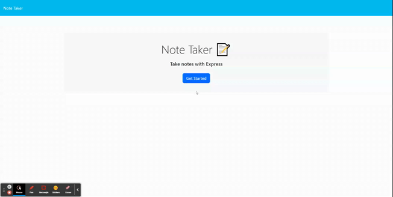

# note-taker

## Description

The purpose of this application is to allow users to easily write and save notes in one place so that they can organize their thoughts and keep track of everything they need. 

## Usage

To use this application, users can click on *Get Started* on the home page, this will take them to the note taking page where users can input a *Note Title* and *Note Text*. After filling out the Note form, the user can then navigate to the top right corner to *Save Note* which will store the note on the left hand side of the page for the user to easily access later on. If the note is no longer needed, the user can click the red trash can next to the note to delete it. 

### Link

[Link to deployed application](https://swift-note-35733492d36b.herokuapp.com/)

## Credits

This application was made using source code from [The Coding Bootcamp](https://github.com/coding-boot-camp/miniature-eureka)!

## Badges

